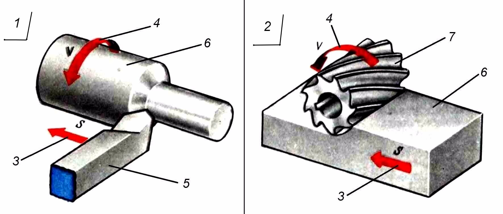

# Визуально-языковой датасет Imagetranslation

**Imagetranslation.org** — это открытый мультиязычный и мультимодальный датасет, связывающий предметные термины с аннотированными иллюстрациями. Каждый термин привязывается к номеру на изображении, переводится на разные языки и при необходимости сопровождается кратким описанием или контекстом использования.

Цель проекта — содействие обучению и тестированию языковых и мультимодальных моделей, а также развитие технического образования с использованием визуального контекста.

---

## ✨ Основные особенности

- Поддержка нескольких языков (`term_ru`, `term_en`, `term_uz`, `term_cn`, `term_de` и др.)
- Визуальная привязка терминов с помощью стрелок и номеров
- Тематическая категоризация (например, "Машиностроение", "Нефтегазовая промышленность")
- Простая и расширяемая структура JSON
- Подходит для ИИ-моделей и образовательных платформ

---

## 📁 Структура датасета

### 🖼️ Пример иллюстрации

Каждая запись в JSON содержит следующие поля:

| Поле                | Описание |
|---------------------|----------|
| `image_file`        | Название файла изображения (например, `track_schematic_diagram.png`) |
| `image_caption_en`  | Подпись к изображению на английском языке (необязательно) |
| `image_caption_ru`  | Подпись к изображению на русском языке (необязательно) |
| `category`          | Тематическая категория изображения |
| `terms`             | Список терминов, отмеченных на изображении |

Каждый термин содержит:

| Поле                        | Описание |
|-----------------------------|----------|
| `label_number`              | Номер стрелки или указателя на изображении |
| `term_*`                    | Термин на соответствующем языке (например, `term_en`, `term_ru`) |
| `context_term_*`            | Краткое определение или пояснение на выбранном языке |

📌 Некоторые поля можно оставить пустыми, если информация пока отсутствует. Структура датасета предусматривает постепенное расширение.

---

## 🛠 Как редактировать и расширять датасет

Редактирование и расширение возможно через интерфейс сайта [https://imagetranslation.org](https://imagetranslation.org).

Вы сможете:

- загрузить чистое изображение (без стрелок и подписей),
- добавить стрелки и номера с помощью встроенных инструментов,
- вводить термины и описания на разных языках.

🔧 *Некоторые функции сайта пока находятся в разработке.*  
В данный момент **экспорт JSON** и добавление **всех полей** ещё недоступны.  
Однако уже работает **основной функционал**: добавление стрелок, номеров, названий и описаний.

---

## 🤝 Сотрудничество

Проект открыт к сотрудничеству!

Вы можете:

- помочь с переводами или заполнением описаний,
- участвовать в разработке и улучшении платформы,
- поддержать проект финансово,
- либо заказать разработку визуального датасета по нужной вам тематике — наша команда готова помочь.

👤 **Автор**: Пяк Павел  
📍 **Город**: Ташкент  
📧 **Email**: admin@imagetranslation.org

---

## 📜 Лицензия

Демо-версия датасета распространяется по лицензии **Creative Commons Attribution-NonCommercial 4.0 International (CC BY-NC 4.0)**.  
Вы можете свободно использовать, распространять и адаптировать этот датасет **в некоммерческих целях** с указанием автора.

🔒 **Коммерческое использование датасета или доступ к полной версии предоставляется только по запросу.**  
Для получения лицензии или сотрудничества свяжитесь с автором.

🔗 [Описание лицензии CC BY-NC 4.0 (RU)](https://creativecommons.org/licenses/by-nc/4.0/deed.ru)
